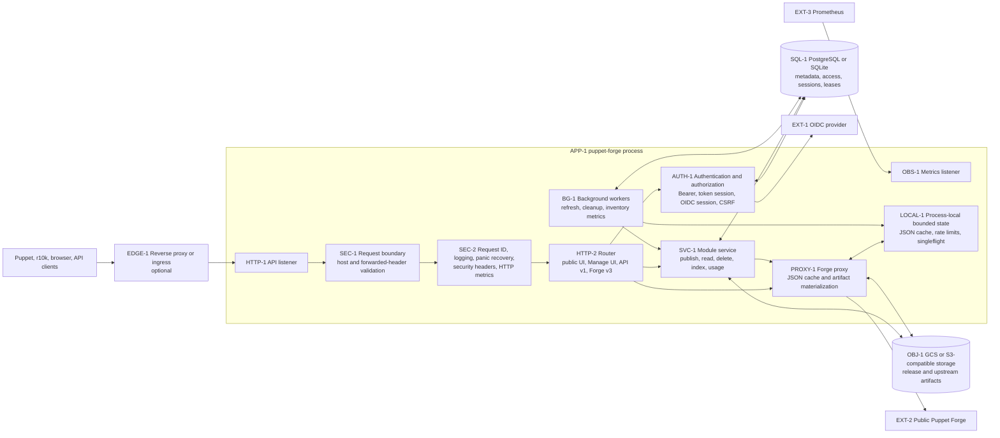
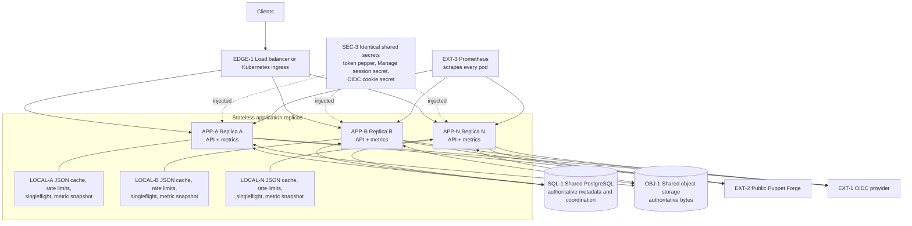
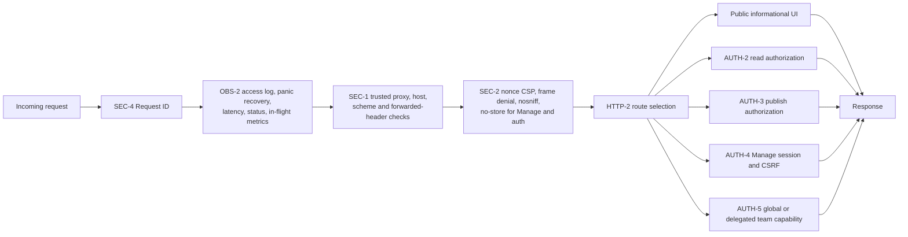
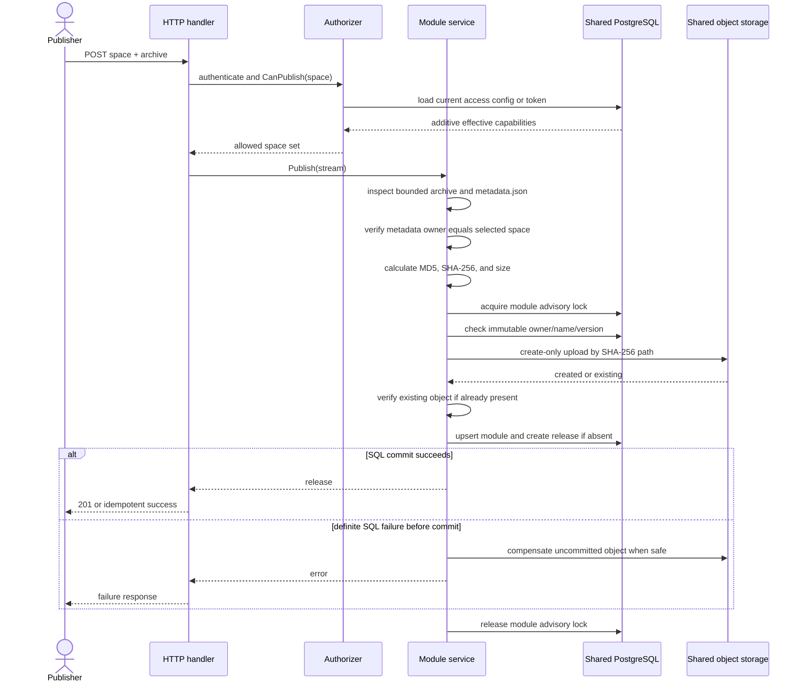
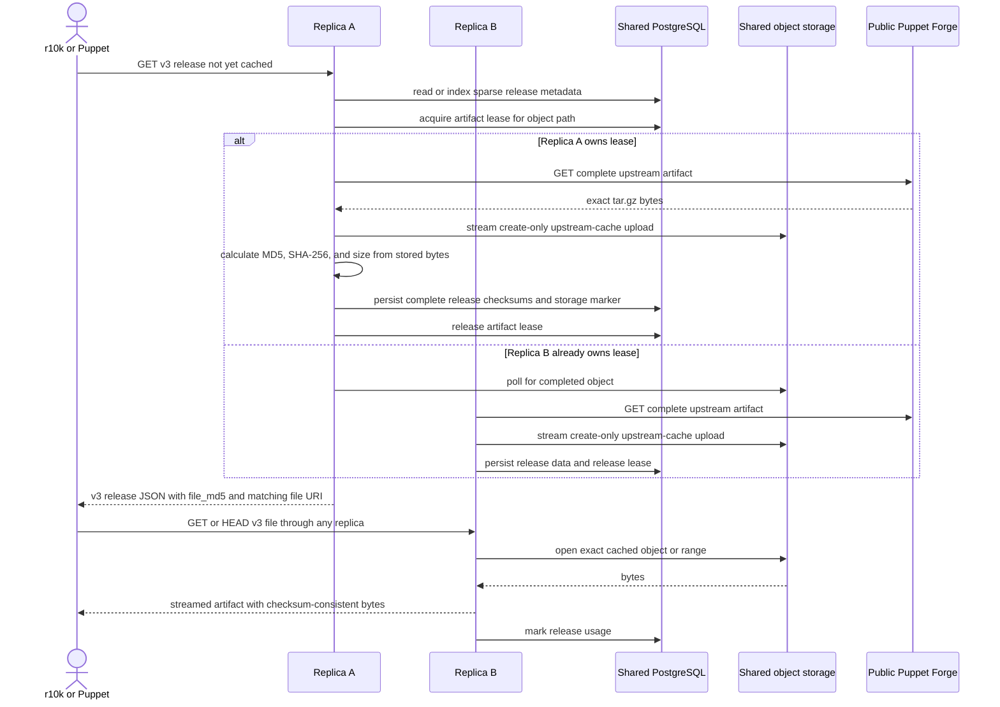
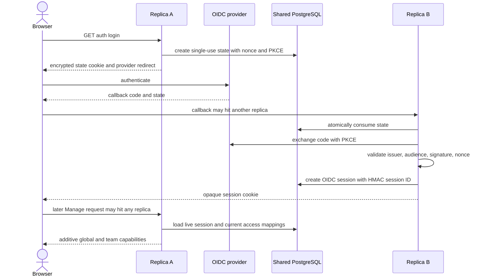
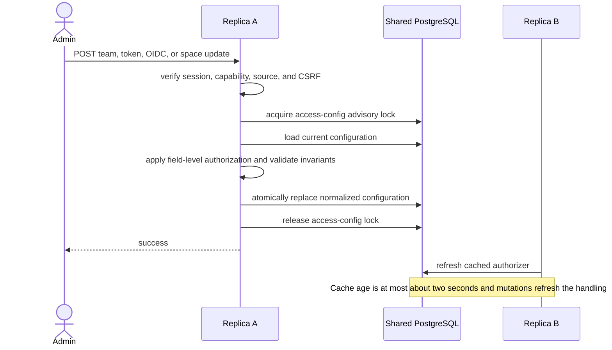
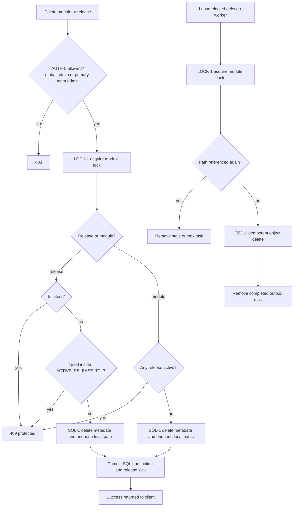
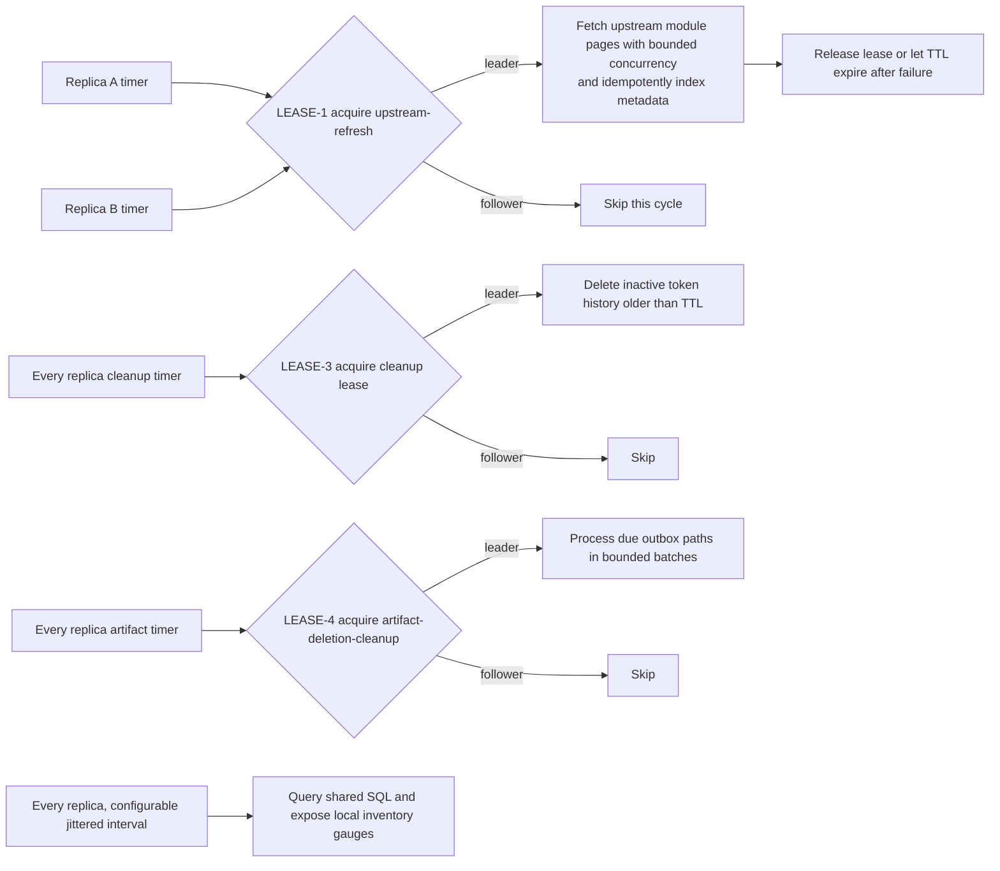

# Runtime Schemas and Verification Map

[Українська версія](SCHEMA.uk.md)

> This document is the operational map of `puppet-forge`. It complements
> [ARCHITECTURE.md](ARCHITECTURE.md), [METRICS.md](METRICS.md), and
> [BACKUP_RESTORE.md](BACKUP_RESTORE.md) with runtime diagrams, state ownership,
> safety boundaries, and point-by-point verification procedures.

## How to Use This Document

Each important runtime node has a stable identifier such as `HTTP-1`, `SQL-1`,
or `BG-1`. Use the identifiers to move between the diagrams, invariant tables,
failure scenarios, and verification playbook.

The diagrams distinguish three kinds of state:

- **shared durable state**: PostgreSQL and object storage; every replica must use
  the same instances;
- **shared secrets**: values that must be identical on every replica but are not
  stored in the application database;
- **process-local state**: bounded caches, singleflight groups, rate-limit
  counters, and metric collectors that intentionally differ between replicas.

Multi-replica correctness depends on shared SQL locks, leases, sessions, and
create-only object writes. It does not depend on sticky HTTP sessions.

## Single-Instance Runtime



### Single-Instance Guarantees

- PostgreSQL is recommended, but SQLite is supported because all writers live in
  one process.
- SQLite module and access-config locks are process mutexes. They are not a
  cross-host coordination mechanism.
- A restart clears process-local caches and rate counters but preserves module,
  access, session, lease, and artifact state.
- The API and metrics listeners are separate. `/metrics` is not exposed by the
  application listener.

## Multi-Instance Runtime



### Multi-Instance Safety Boundaries

| Node        | Boundary                                           | Coordination mechanism                                                              | What happens if it is wrong                                                                         |
| ----------- | -------------------------------------------------- | ----------------------------------------------------------------------------------- | --------------------------------------------------------------------------------------------------- |
| `SQL-1`     | All replicas use one PostgreSQL database           | transactions, constraints, advisory locks, leases                                   | split access config, duplicate work, inconsistent sessions                                          |
| `OBJ-1`     | All replicas use one bucket and prefix             | create-only writes and checksum verification                                        | a release exists in SQL but not from every replica's storage view                                   |
| `SEC-3`     | Secrets are byte-identical on every replica        | Kubernetes Secret or equivalent secret manager                                      | random login failures, invalid sessions, tokens accepted only by some pods                          |
| `LOCK-1`    | One writer mutates a module identity at a time     | PostgreSQL advisory module lock                                                     | conflicting publish/delete operations                                                               |
| `LOCK-2`    | One writer replaces access configuration at a time | PostgreSQL advisory access-config lock                                              | lost team/token/OIDC updates                                                                        |
| `LEASE-1`   | One periodic upstream refresh leader               | SQL lease `upstream-refresh`; leader-local `UPSTREAM_SYNC_CONCURRENCY` worker bound | duplicated or unbounded refresh traffic; correctness remains idempotent but load increases          |
| `LEASE-2`   | One replica materializes a cold upstream artifact  | SQL lease derived from object path, 75-second TTL                                   | duplicate upstream downloads or prolonged cold-request latency                                      |
| `LEASE-3`   | One token-history cleanup leader                   | SQL lease `access-token-history-cleanup`                                            | duplicate cleanup work; SQL deletion remains idempotent                                             |
| `LEASE-4`   | One durable artifact-deletion leader               | SQL lease `artifact-deletion-cleanup`                                               | duplicate idempotent object deletes; module lock and reference recheck preserve republished content |
| `LEASE-5`   | One deleted-release retention leader               | SQL lease `deleted-release-cleanup`                                                 | duplicate tombstone cleanup; SQL deletion remains idempotent                                        |
| `LEASE-6`   | One release-usage retention leader                 | SQL lease `release-usage-cleanup`                                                   | stale usage rows remain longer; active-release queries still enforce their timestamp window         |
| `LEASE-7`   | One browser-session retention leader               | SQL lease `session-state-cleanup`                                                   | expired or consumed session rows remain longer; authentication still checks expiry and revocation   |
| `LEASE-8`   | One shared-rate-limit retention leader             | SQL lease `rate-limit-cleanup`                                                      | expired limiter rows remain longer; active counters remain correct                                  |
| `SESSION-1` | Browser sessions are shared                        | opaque cookie ID plus SQL session row                                               | sticky-session dependence or role changes not propagating                                           |
| `CACHE-1`   | JSON response cache is deliberately local          | bounded TTL/LRU-style eviction                                                      | different cache hit ratios and briefly different upstream JSON freshness                            |
| `RATE-1`    | Sensitive mutation/login limits are shared         | atomic SQL counters plus retention                                                  | limiter storage failure rejects sensitive requests rather than bypassing protection                 |
| `RATE-2`    | High-volume read limits are deliberately local     | bounded counters, expiry heap, nearest-reset eviction at capacity                   | total read allowance scales with replica count; use edge limiting for a hard global quota           |

SQLite is not a multi-instance backend. Helm validation must reject SQLite when
`replicaCount` is greater than one or autoscaling is enabled.

## Request Pipeline



Middleware order is intentional: request IDs and observability still cover
requests rejected at the public-boundary or security layer.

## HTTP Method and Action Inventory

The table lists the intended externally reachable actions. Handlers with
explicit method dispatch return `405 Method Not Allowed` for unsupported
methods; unknown resources return `404 Not Found`. Probe and OIDC endpoints are
listed with the methods used by their normal clients.

| Method        | Path                                                         | Action                                                            | Required capability or guard                                                                                                         |
| ------------- | ------------------------------------------------------------ | ----------------------------------------------------------------- | ------------------------------------------------------------------------------------------------------------------------------------ |
| `GET`         | `/healthz`                                                   | process liveness                                                  | none; does not check dependencies                                                                                                    |
| `GET`         | `/readyz`                                                    | SQL and artifact-storage readiness                                | two-second dependency deadline                                                                                                       |
| `GET`         | `/`                                                          | public module catalog and filtering                               | always informationally public                                                                                                        |
| `GET`         | `/modules/{owner}/{name}`                                    | public module details                                             | always informationally public                                                                                                        |
| `GET`         | `/modules/{owner}/{name}/versions/{version}/files/{path}`    | extracted archive file                                            | read authorization unless public module access is enabled                                                                            |
| `GET`         | `/auth/login`                                                | start OIDC login                                                  | OIDC enabled; shared SQL rate limit                                                                                                  |
| `GET`         | `/auth/callback`                                             | validate OIDC response and create shared session                  | state cookie, SQL state, nonce, PKCE, shared SQL rate limit                                                                          |
| `GET`         | `/auth/logout`                                               | revoke OIDC session and optionally end provider session           | valid or stale session accepted for cleanup                                                                                          |
| `GET`         | `/manage/login`                                              | render token/OIDC login                                           | no-store response                                                                                                                    |
| `POST`        | `/manage/login`                                              | create token-backed browser session                               | valid admin/team credential, shared SQL rate limit                                                                                   |
| `POST`        | `/manage/logout`                                             | revoke browser session                                            | session-bound CSRF                                                                                                                   |
| `GET`         | `/manage`                                                    | overview                                                          | global admin or team management capability                                                                                           |
| `GET`         | `/manage/modules`                                            | manageable module catalog                                         | global admin or team management capability                                                                                           |
| `POST`        | `/manage/modules`                                            | publish module archive                                            | selected-space publish capability, CSRF, upload limit                                                                                |
| `POST`        | `/manage/modules/{owner}/{name}/delete`                      | delete module                                                     | global delete or primary-team admin delete, CSRF, protected-release checks                                                           |
| `POST`        | `/manage/modules/{owner}/{name}/versions/{version}/delete`   | delete release                                                    | global delete or primary-team admin delete, CSRF, latest/active protection                                                           |
| `POST`        | `/manage/upstream`                                           | explicitly index an upstream module                               | global administrator, CSRF                                                                                                           |
| `GET`         | `/manage/teams`                                              | list manageable teams                                             | global admin sees all; team admin sees assigned teams                                                                                |
| `GET`         | `/manage/teams/new`                                          | render team creation                                              | global administrator                                                                                                                 |
| `POST`        | `/manage/teams/new`                                          | create team                                                       | global administrator, CSRF, validation                                                                                               |
| `GET`         | `/manage/teams/{team}`                                       | compatibility redirect to team Access                             | global admin or that team administrator                                                                                              |
| `GET`         | `/manage/teams/{team}/access`                                | team access settings                                              | global admin or that team administrator                                                                                              |
| `GET`         | `/manage/teams/{team}/tokens`                                | active and historical tokens                                      | global admin or that team administrator                                                                                              |
| `GET`         | `/manage/teams/{team}/modules`                               | team module catalog and publish form                              | global admin or that team administrator                                                                                              |
| `GET`         | `/manage/admin/access`                                       | global OIDC access settings                                       | global administrator                                                                                                                 |
| `POST`        | `/manage/admin/access`                                       | update global OIDC mappings or an authorized team's OIDC mappings | global administrator for global fields; global or matching team administrator for team fields; field-level policy, CSRF, config lock |
| `GET`         | `/manage/admin/spaces`                                       | publish-space assignments                                         | global administrator                                                                                                                 |
| `POST`        | `/manage/admin/spaces`                                       | assign or unassign extra publish spaces                           | global administrator, CSRF, config lock; primary team space is immutable                                                             |
| `GET`         | `/manage/access`                                             | compatibility redirect to global Access                           | authentication before canonical redirect                                                                                             |
| `POST`        | `/manage/access`                                             | compatibility global or team access mutation                      | same capability, field-level policy, CSRF, and config-lock checks as `/manage/admin/access`                                          |
| `GET`         | `/manage/access/add`                                         | compatibility redirect to Add Team                                | global administrator                                                                                                                 |
| `POST`        | `/manage/access/add`                                         | compatibility team creation                                       | global administrator, CSRF, config lock                                                                                              |
| `POST`        | `/manage/access/token`                                       | create, rotate, or revoke a team token                            | global admin or that team administrator, CSRF, config lock                                                                           |
| `GET`         | `/api/v1/modules`                                            | list and search modules                                           | read capability; local search rate limit                                                                                             |
| `POST`        | `/api/v1/modules`                                            | publish multipart `space` plus `file`                             | publish capability for selected space; archive metadata is authoritative                                                             |
| `GET`         | `/api/v1/manage/publish-spaces`                              | list caller's effective publish spaces                            | publish-capable principal                                                                                                            |
| `GET`         | `/api/v1/modules/{owner}/{name}`                             | module metadata                                                   | read capability                                                                                                                      |
| `DELETE`      | `/api/v1/modules/{owner}/{name}`                             | delete module                                                     | global or primary-team delete capability; protected-release checks                                                                   |
| `GET`         | `/api/v1/modules/{owner}/{name}/versions/{version}`          | release metadata                                                  | read capability; cold upstream checksum materialization when required                                                                |
| `DELETE`      | `/api/v1/modules/{owner}/{name}/versions/{version}`          | delete release                                                    | global or primary-team delete capability; latest/active protection                                                                   |
| `GET`, `HEAD` | `/api/v1/modules/{owner}/{name}/versions/{version}/download` | stream release bytes                                              | read capability, range/ETag support, local download rate limit                                                                       |
| `GET`         | `/v3/modules/{slug}`                                         | Puppet Forge v3 module metadata                                   | read capability unless public access; fresh responses index metadata, while fresh and cached responses mark observed release usage   |
| `GET`         | `/v3/releases/{slug}`                                        | Puppet Forge v3 release metadata                                  | read capability unless public access; complete checksum fields                                                                       |
| `GET`, `HEAD` | `/v3/files/{filename}`                                       | Puppet Forge-compatible artifact stream                           | read capability unless public access; shared cold-cache coordination and range support                                               |
| `GET`, `HEAD` | other `/v3/*`                                                | transparent upstream Forge proxy                                  | read capability unless public access; bounded JSON or artifact cache path                                                            |
| `GET`         | metrics listener `/metrics`                                  | Prometheus exposition                                             | separate listener; protect at network layer if required                                                                              |

`PUBLIC_MODULE_ACCESS=true` bypasses only read authorization. It never grants
publish, delete, team administration, global administration, or Manage session
capabilities.

## Internal Method and Action Inventory

| Component                   | Main actions                                                                                         | Durable side effects                                     |
| --------------------------- | ---------------------------------------------------------------------------------------------------- | -------------------------------------------------------- |
| `APP-1` application         | open stores, wire dependencies, start listeners/workers, graceful shutdown                           | schema bootstrap; worker leases                          |
| `AUTH-1` authorizer         | authenticate token, map OIDC claims, merge global and team capabilities, list publish spaces         | token `last_used` timestamp                              |
| `SESSION-1` Manage sessions | create, load, refresh, revoke token and OIDC browser sessions                                        | `manage_sessions`, `oidc_sessions`                       |
| `OIDC-1` OIDC flow          | discover provider, create state/nonce/PKCE, exchange code, validate ID token, logout                 | `oidc_states`, `oidc_sessions`                           |
| `SVC-1` module service      | publish, list/get, stream download, delete, inspect archive, index upstream, mark usage, refresh     | module/release/usage/tombstone/outbox rows and artifacts |
| `PROXY-1` Forge proxy       | fetch module/release JSON, cache JSON, relay upstream response, materialize artifacts                | upstream-cache objects; artifact leases                  |
| `SQL-1` store               | module/release CRUD, access replacement, locks, leases, sessions, usage, tombstones, deletion outbox | PostgreSQL or SQLite tables                              |
| `OBJ-1` storage             | stat, open, range-open, create-only upload, delete, list, download                                   | GCS/S3 objects                                           |
| `OBS-1` observability       | request metrics/logs, operation counters, inventory snapshots, build info                            | Prometheus process memory only                           |
| `RECON-1` reconciliation    | compare SQL artifact records with object storage; optionally delete orphans                          | repair mode deletes only unreferenced objects            |

## Module Publish Sequence



Publish invariants:

1. Only `space` and `file` are accepted; caller-provided identity overrides are
   rejected.
2. `metadata.json` is the identity source of truth.
3. The archive owner must equal the selected authorized space.
4. One module/version maps to one immutable byte sequence.
5. The object path is content-addressed and the write operation is create-only.
6. Retrying the same bytes is idempotent; different bytes return a conflict.

## Cold Upstream Release and r10k Sequence



The first response must contain `file_md5`; it is calculated from the same bytes
later served by `/v3/files/*`. This prevents a first-run missing-method failure
and a second-run checksum mismatch.

The file body is not buffered in replica memory. The lease owner validates size
and `Content-Length` while streaming upstream into object storage; a client is
served only by reopening the successfully committed shared object.

Cold module-response observation and SQL indexing complete before the response
is written, so the client's next release request cannot observe partial rows.
The observer preserves request values but uses a detached, 30-second context;
client cancellation cannot abort indexing, while the independent timeout still
bounds a stalled observer.
JSON cache hits still mark the current release as used but skip repeated module
and release indexing. A later cache miss or periodic refresh reconciles fresh
upstream metadata.

## Browser Authentication Across Replicas



Token login uses the same cross-replica model: the browser receives an opaque
session ID while the credential binding, CSRF secret, expiry, and revocation
state live in shared SQL.

Required identical values on every replica:

- `ACCESS_TOKEN_PEPPER`;
- `MANAGE_SESSION_SECRET`;
- `OIDC_COOKIE_SECRET` when OIDC is enabled;
- OIDC client ID, client secret, issuer, and redirect policy.

`ACCESS_TOKEN_PEPPER` and `MANAGE_SESSION_SECRET` must be independent values;
startup rejects deployments that reuse the same key material for both roles.

## Access-Configuration Mutation and Propagation



Roles are additive. A user who is both a global administrator and a team
administrator retains both global administration and all matching team module,
token, and OIDC capabilities.

## Delete Sequence and Protection Rules



Extra publish spaces grant publish/update permission, not delete ownership. A
delegated team administrator can delete only in the team's primary space.
Storage failures keep the outbox row for a later retry. SQL never retains a
release row that points to an object already deleted by this workflow. Explicit
reconciliation repair uses the same per-module lock and reference recheck before
deleting an orphan under the local artifact prefix.

## Background Work and Leader Election



| Worker                        | Scope                 | Coordination                                                     | Failure recovery                                                                                    |
| ----------------------------- | --------------------- | ---------------------------------------------------------------- | --------------------------------------------------------------------------------------------------- |
| periodic upstream refresh     | singleton             | SQL lease, duration `max(2 * interval, 30s)`                     | another replica acquires after release or expiry; upserts are idempotent                            |
| cold artifact materialization | one leader per object | SQL lease, 75-second TTL; local singleflight inside each process | waiters poll object storage; another replica retries after lease expiry                             |
| inactive token cleanup        | singleton             | one-hour SQL lease                                               | safe to repeat because deletion is idempotent                                                       |
| artifact deletion cleanup     | singleton             | two-minute SQL lease; module lock per object                     | storage failures are deferred for one minute; reference recheck cancels stale tasks after republish |
| inventory metric collection   | every replica         | none                                                             | each pod refreshes its own bounded snapshot from shared SQL                                         |

## Durable Data Model

```mermaid
erDiagram
    MODULES ||--o{ RELEASES : contains
    MODULES ||--o{ RELEASE_USAGE : records
    MODULES ||--o{ DELETED_RELEASES : suppresses
    ACCESS_TEAMS ||--o{ ACCESS_TOKENS : owns
    ACCESS_TEAMS ||--o{ ACCESS_PUBLISH_OWNERS : grants
    ACCESS_TEAMS ||--o{ ACCESS_OIDC_MAPPINGS : maps
    MANAGE_SESSIONS }o--|| ACCESS_TOKENS : binds

    MODULES {
        string id PK
        string owner
        string name
        string slug UK
        string latest_version
    }
    RELEASES {
        string id PK
        string module_id FK
        string version
        string source
        string storage_path
        string md5
        string sha256
        int size_bytes
    }
    RELEASE_USAGE {
        string module_id FK
        string version
        timestamp last_used_at
    }
    DELETED_RELEASES {
        string module_id FK
        string version
        timestamp deleted_at
    }
    ARTIFACT_DELETIONS {
        string storage_path PK
        string owner
        string name
        timestamp created_at
        timestamp next_attempt_at
    }
    ACCESS_TEAMS {
        string team PK
    }
    ACCESS_TOKENS {
        string token_id PK
        string team FK
        string role
        string token_hash UK
        timestamp expires_at
        timestamp revoked_at
    }
    ACCESS_PUBLISH_OWNERS {
        string team FK
        string owner
    }
    ACCESS_OIDC_MAPPINGS {
        string team FK
        string kind
        string value
    }
    MANAGE_SESSIONS {
        string session_hash PK
        string credential_id FK
        string csrf_secret
        timestamp expires_at
        timestamp revoked_at
    }
    OIDC_STATES {
        string state_hash PK
        string nonce
        string pkce_verifier
        timestamp expires_at
        timestamp consumed_at
    }
    OIDC_SESSIONS {
        string session_hash PK
        string subject
        string email
        string csrf_secret
        timestamp expires_at
        timestamp revoked_at
    }
    APP_LEASES {
        string name PK
        string holder
        timestamp expires_at
    }
    SCHEMA_METADATA {
        int version
    }
```



Schema bootstrap is serialized in PostgreSQL with a global advisory lock. A
binary refuses to run against a schema version newer than it understands.

## State Ownership and Consistency

| State                                        | Location                            | Scope                      | Consistency and expiry                                                                                                                                |
| -------------------------------------------- | ----------------------------------- | -------------------------- | ----------------------------------------------------------------------------------------------------------------------------------------------------- |
| modules, releases, latest version            | SQL                                 | shared                     | transactional and constraint-protected                                                                                                                |
| release bytes                                | object storage                      | shared                     | immutable create-only object, verified by SHA-256 and size                                                                                            |
| release usage                                | SQL                                 | shared                     | active window uses `ACTIVE_RELEASE_TTL`; replicas coalesce writes through bounded throttles, while one lease-elected worker prunes expired rows daily |
| deleted upstream release tombstones          | SQL                                 | shared                     | background refresh is suppressed until TTL cleanup; an exact client request can deliberately restore a version on demand                              |
| teams, token metadata, OIDC mappings, spaces | SQL                                 | shared                     | serialized replacement; authorizer cache refresh up to about two seconds                                                                              |
| token and OIDC browser sessions              | SQL plus opaque cookie              | shared                     | eight-hour TTL, explicit revocation, checked on each request                                                                                          |
| OIDC login state                             | SQL plus transient encrypted cookie | shared                     | five-minute TTL, atomically single-use                                                                                                                |
| refresh and cleanup leadership               | SQL                                 | shared                     | lease holder plus expiry                                                                                                                              |
| upstream artifact ownership                  | SQL and object storage              | shared                     | per-object lease plus create-only object                                                                                                              |
| upstream JSON response cache                 | memory                              | per replica                | bounded by entry count/bytes and fresh/stale TTL                                                                                                      |
| request rate counters                        | memory                              | per replica                | bounded key set; not a cluster quota                                                                                                                  |
| artifact singleflight                        | memory                              | per replica                | suppresses duplicate work only inside one process                                                                                                     |
| token-use write throttle                     | memory                              | per replica plus SQL guard | reduces writes; SQL rejects stale timestamp movement                                                                                                  |
| inventory metric snapshot                    | memory                              | per replica                | rebuilt from shared SQL on the jittered `METRICS_REFRESH_INTERVAL`                                                                                    |
| operation counters                           | Prometheus registry                 | per replica                | aggregate counters across pods with `sum` and `rate`                                                                                                  |

Before local release metadata is served for an upstream artifact, persisted
bytes are checked against the recorded SHA-256 and size. Repair holds the same
per-object SQL lease used for cold materialization. A separate daily lease
removes only unreferenced `upstream-cache/` objects older than
`UPSTREAM_ARTIFACT_ORPHAN_TTL`.

## Observability and Aggregation in Multiple Replicas

Prometheus must discover and scrape every metrics service endpoint.

| Metric shape                                          | Correct cluster query pattern                         | Reason                                                       |
| ----------------------------------------------------- | ----------------------------------------------------- | ------------------------------------------------------------ |
| request, publish, delete, usage, cache, sync counters | `sum by (...) (rate(metric_total[$__rate_interval]))` | each pod owns only its own counter increments                |
| identical inventory gauges derived from shared SQL    | `max by (...) (metric)`                               | summing multiplies inventory by replica count                |
| in-flight request gauge                               | `sum(metric)`                                         | each pod has distinct in-flight requests                     |
| singleton refresh timestamps/durations                | `max by (...) (metric)`                               | only the current or previous leader updates a series         |
| `up` and target health                                | inspect per `instance` before aggregating             | one unhealthy replica must not be hidden by healthy replicas |

Correlate a failed request with its structured `request_id`. For lease-related
issues, enable `LOG_LEVEL=debug`; refresh leadership and upstream cache decisions
emit debug diagnostics without credentials or session values.

## Point Verification Matrix

| Node        | Invariant to verify                                                                       | Observable evidence                                                                 | Automated coverage or check                         |
| ----------- | ----------------------------------------------------------------------------------------- | ----------------------------------------------------------------------------------- | --------------------------------------------------- |
| `HTTP-1`    | API and metrics listeners bind independently                                              | startup log contains both addresses; both health targets connect                    | `make http-smoke`                                   |
| `SEC-1`     | untrusted forwarded headers cannot change public origin                                   | warning/rejection reason and `400` or `421`                                         | request-boundary unit and fuzz tests                |
| `SEC-2`     | Manage/auth responses are non-cacheable; framing and unapproved inline content are denied | response security headers with a per-request CSP nonce                              | router response tests                               |
| `AUTH-1`    | combined global and team roles are additive                                               | same user sees global and every matching team capability                            | authorizer and router combined-role tests           |
| `AUTH-2`    | public mode bypasses read only                                                            | anonymous GET succeeds; publish/delete still fail                                   | router public-access tests                          |
| `AUTH-3`    | selected publish space is checked on backend                                              | tampered space returns `403`                                                        | publish authorization tests                         |
| `AUTH-4`    | Manage mutation requires valid same-session CSRF                                          | missing/mismatched token returns `403`; debug source reason                         | CSRF and cross-origin tests                         |
| `SESSION-1` | session created on one replica works on another                                           | alternate requests between pod endpoints                                            | shared-session tests                                |
| `OIDC-1`    | state is single-use and PKCE/nonce bound                                                  | replay callback fails; valid callback across replicas succeeds                      | OIDC flow tests                                     |
| `SVC-1`     | metadata identity equals selected space                                                   | mismatched archive returns validation error                                         | archive consistency tests                           |
| `LOCK-1`    | concurrent same-version publish is deterministic                                          | one immutable release and one object                                                | concurrent publish test and PostgreSQL parity test  |
| `LOCK-2`    | concurrent access updates do not lose fields                                              | serialized final normalized config                                                  | access-config lock parity test                      |
| `OBJ-1`     | SQL checksum matches exact served bytes                                                   | reconcile report is clean; download SHA-256 matches SQL                             | object-storage integration and reconciliation tests |
| `PROXY-1`   | first cold release response includes valid `file_md5`                                     | first r10k run succeeds; JSON checksum matches downloaded file                      | cold release checksum test                          |
| `LEASE-1`   | one refresh leader per database                                                           | one replica logs lease acquired; followers log skipped                              | lease parity and refresh tests                      |
| `LEASE-2`   | one upstream fetch per cold object cluster-wide                                           | one upstream request while concurrent replicas complete                             | cross-replica proxy coalescing test                 |
| `LEASE-3`   | history cleanup is singleton and repeatable                                               | one purge count per cycle; no active tokens removed                                 | cleanup store/service tests                         |
| `LEASE-4`   | artifact cleanup is singleton, retryable, and republish-safe                              | pending gauge drains; error counter stops increasing; referenced paths are canceled | outbox store parity and service cleanup tests       |
| `READY-1`   | readiness fails when SQL or object-storage create/read/delete capability is unavailable   | `/readyz` changes from `200` to `503`; successful storage probes are cached for 5m  | readiness tests and Kubernetes probe                |
| `RECON-1`   | repair never deletes SQL metadata or corrupt/missing records                              | JSON reconciliation report and orphan-only deletion                                 | reconciliation tests                                |
| `OBS-1`     | all replicas are scraped                                                                  | Prometheus targets show one target per pod                                          | `make check` plus deployed target inspection        |

## Manual Multi-Replica Verification Playbook

Run these checks against a disposable environment. Replace placeholders with
test-only values; never use production tokens in shell history.

### 1. Confirm Shared Configuration

Verify that every pod has the same non-secret database/bucket/prefix settings and
references the same Secret object. Compare secret checksums, not secret values.

```bash
kubectl -n <namespace> get pods -l app.kubernetes.io/name=puppet-forge
kubectl -n <namespace> get deploy puppet-forge -o yaml
kubectl -n <namespace> get secret <secret-name> -o jsonpath='{.metadata.resourceVersion}'
```

Pass condition: all replicas use PostgreSQL, one object bucket/prefix, and one
secret source. No pod uses an ephemeral SQLite file.

### 2. Verify Per-Pod Health and Readiness

```bash
kubectl -n <namespace> get pods -l app.kubernetes.io/name=puppet-forge -o wide
kubectl -n <namespace> describe pods -l app.kubernetes.io/name=puppet-forge
kubectl -n <namespace> port-forward pod/<pod-name> 18080:8080
curl -fsS http://127.0.0.1:18080/healthz
curl -fsS http://127.0.0.1:18080/readyz
```

Repeat for every pod. Pass condition: liveness and readiness are healthy on every
replica. Readiness verifies SQL and object storage, but not the external Forge.

### 3. Verify Session Portability

Port-forward two pods on different local ports. Start a login through one pod,
then reuse the browser cookie jar against the other pod.

```bash
curl -c session.cookies -b session.cookies -L http://127.0.0.1:18081/manage/login
curl -c session.cookies -b session.cookies -i http://127.0.0.1:18082/manage
```

For token login, submit the login form and its CSRF fields as rendered by the
test instance. Pass condition: the authenticated page and effective roles are
identical on both pods without session affinity.

### 4. Verify Access-Change Propagation

Create or revoke a disposable team token through replica A. Immediately query a
protected endpoint through replica B, then repeat after two seconds to cover new
credential propagation as well as revocation.

```bash
curl -i -H 'Authorization: Bearer <disposable-token>' \
  http://127.0.0.1:18082/api/v1/modules
```

Pass condition: revoked credentials become unusable cluster-wide immediately
after the SQL commit because every bearer request validates the token ID in SQL.
New credentials become visible after the normal authorizer cache bound of
approximately two seconds; browser sessions are re-evaluated against current
access config.

### 5. Verify Concurrent Immutable Publish

Send the same module/version archive to two different pods concurrently, then
send a different archive claiming the same identity.

```bash
curl -fsS -H 'Authorization: Bearer <publish-token>' \
  -F 'space=<space>' -F 'file=@<module.tar.gz>' \
  http://127.0.0.1:18081/api/v1/modules &
curl -fsS -H 'Authorization: Bearer <publish-token>' \
  -F 'space=<space>' -F 'file=@<module.tar.gz>' \
  http://127.0.0.1:18082/api/v1/modules &
wait
```

Pass condition: identical retries converge on one release and one content object;
different bytes for the same owner/name/version return `409 Conflict`.

### 6. Verify Cold Upstream Coalescing and Checksums

Request one uncached public release through two replicas at the same time. Check
debug logs for one artifact-lease owner and follower waiting behavior. Compare
the release `file_md5` with the downloaded bytes.

```bash
curl -fsS http://127.0.0.1:18081/v3/releases/<release-slug>
curl -fsS -o release.tar.gz http://127.0.0.1:18082/v3/files/<archive-name>
md5sum release.tar.gz
sha256sum release.tar.gz
```

Pass condition: the first metadata response already has `file_md5`, both replicas
serve identical bytes, and only one replica downloads the cold object upstream.

### 7. Verify Refresh Leader Failover

Enable debug logging and identify the pod holding `upstream-refresh`. Delete that
pod and observe the next refresh interval.

```bash
kubectl -n <namespace> logs -l app.kubernetes.io/name=puppet-forge --prefix \
  | grep 'upstream refresh lease'
kubectl -n <namespace> delete pod <leader-pod>
```

Pass condition: another pod acquires the lease after explicit release or lease
expiry and refresh continues without duplicate module identities.

### 8. Verify Prometheus Aggregation

Inspect Prometheus targets and run both per-instance and aggregated queries.

```promql
up{job=~".*puppet-forge.*"}
sum by (route, status) (rate(puppet_forge_http_requests_total[5m]))
max by (source) (puppet_forge_module_releases)
```

Pass condition: every pod is a target, counters combine with `sum`, and shared
inventory does not multiply with replica count.

### 9. Verify Reconciliation

Run report-only reconciliation against a restored or disposable environment.

```bash
puppet-forge --reconcile-artifacts
```

Pass condition: the report has no missing, corrupt, or orphan artifacts. Use
repair mode only for confirmed orphan objects; it intentionally does not repair
missing or corrupt release data.

## Failure Scenarios

| Failure                                    | Expected behavior                                                                                         | Operator check                                                     |
|--------------------------------------------|-----------------------------------------------------------------------------------------------------------|--------------------------------------------------------------------|
| one application pod exits                  | traffic continues through remaining ready pods                                                            | Kubernetes endpoints and per-instance `up`                         |
| PostgreSQL unavailable                     | `/readyz` fails; state-changing operations fail; pods should leave ready endpoints                        | readiness events and SQL errors                                    |
| object storage unavailable                 | `/readyz` fails; publish/download/delete fail without deleting SQL first                                  | readiness events, storage logs, operation counters, reconciliation |
| upstream Forge unavailable                 | local modules and cached artifacts continue; bounded stale JSON may be served; new cold artifacts fail    | upstream cache/sync metrics and proxy logs                         |
| refresh leader exits                       | lease expires or is released; another replica takes over                                                  | refresh lease debug logs and last-success age                      |
| artifact leader exits mid-download         | no partial object is committed; waiter retries after lease expiry                                         | artifact lease logs and object checksum                            |
| one replica has a different session secret | sessions fail only when traffic reaches that replica                                                      | compare secret source/checksum; alternate direct pod requests      |
| one replica has stale access cache         | refresh occurs after 2s; SQL failure permits at most 30s stale state before protected requests return 503 | inspect access refresh logs and SQL health                         |
| Prometheus scrapes only one pod            | cluster traffic and errors are undercounted                                                               | targets page and per-instance `up`                                 |
| HPA changes replica count                  | shared correctness remains; local rate capacity and cache warmth change                                   | HPA events, target count, cache hit ratio                          |

## Kubernetes Production Checklist

- Use PostgreSQL; never use SQLite with multiple replicas or HPA.
- Use one shared GCS bucket or S3-compatible bucket and one artifact prefix. A
  selected S3-compatible backend must atomically enforce `If-None-Match: *` for
  create-only `PutObject` requests.
- Source all session/hash/OIDC secrets from one Kubernetes Secret or external
  secret and roll every pod after changing it.
- Keep startup, liveness, and readiness probes enabled.
- Scrape every pod through the dedicated metrics service and ServiceMonitor.
- Aggregate counters with `sum`; aggregate duplicated inventory gauges with
  `max`.
- Keep at least two replicas, a PodDisruptionBudget, and topology spread for
  availability.
- Configure edge-level rate limiting when a strict cluster-wide quota is needed.
- Enable NetworkPolicy or equivalent controls for API, metrics, SQL, object
  storage, OIDC, and upstream egress according to the deployment environment.
- Alert on readiness failures, missing scrape targets, 5xx ratio, publish/delete
  errors, and refresh failures/age. Schedule the one-shot reconciliation command
  separately and alert externally on its non-zero exit status or non-empty drift
  report; the service does not export reconciliation state as a Prometheus metric.
- Test leader failover, cross-pod sessions, concurrent publish, and cold upstream
  materialization before production rollout.

## Related Documentation

- [README.md](README.md): installation, configuration, and API usage.
- [README.uk.md](README.uk.md): Ukrainian user and operator guide.
- [ARCHITECTURE.md](ARCHITECTURE.md): package responsibilities and design rules.
- [METRICS.md](METRICS.md): metric definitions and label semantics.
- [BACKUP_RESTORE.md](BACKUP_RESTORE.md): recovery and reconciliation procedure.
- [Helm chart](deploy/puppet-forge): Kubernetes deployment configuration.
- [Grafana dashboard](examples/grafana/puppet-forge-dashboard.json): operational views.
- [Prometheus alerts](examples/prometheus/alerts/puppet-forge.yml): example alert rules.
