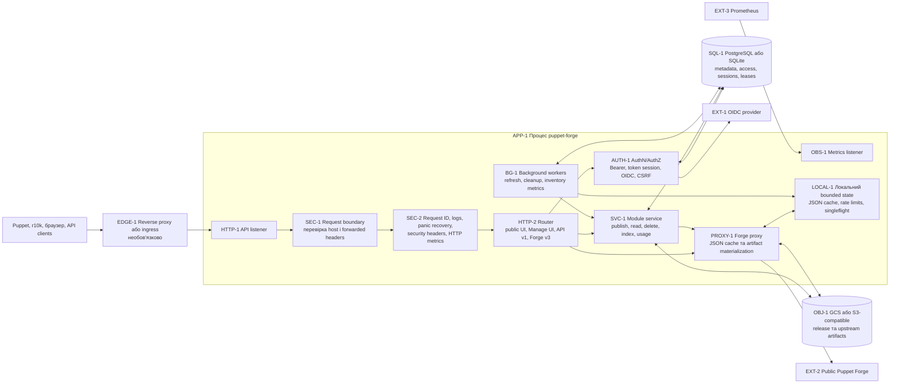
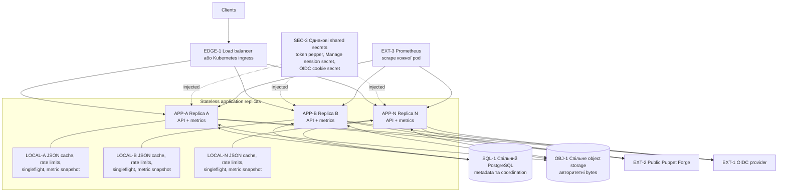
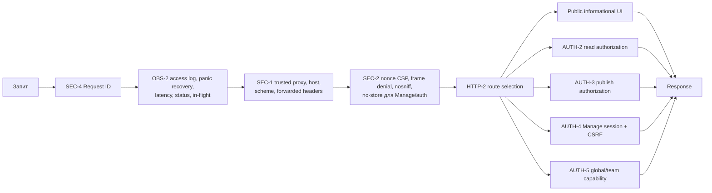
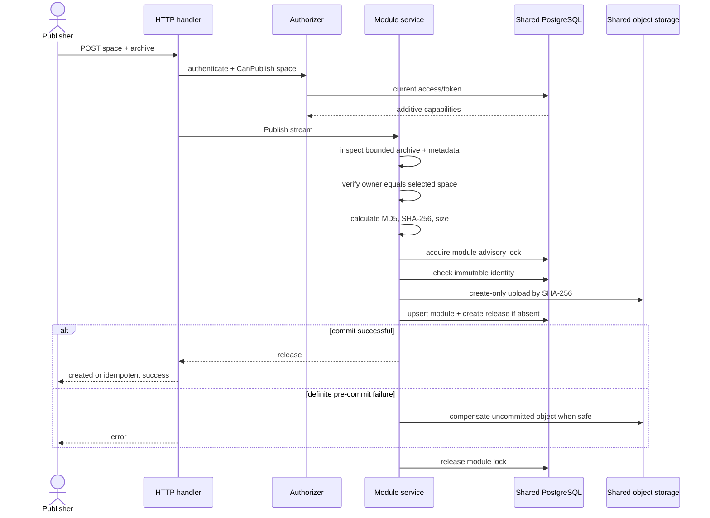
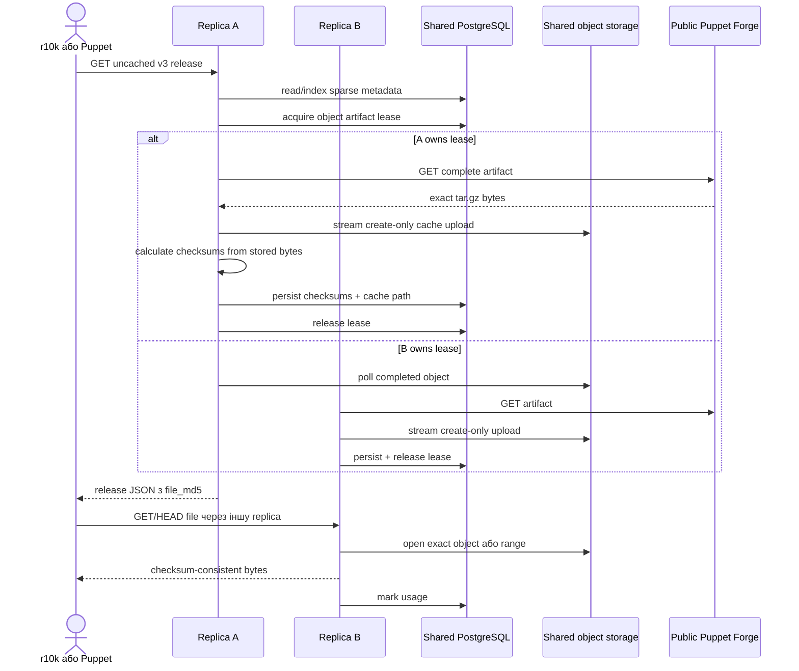
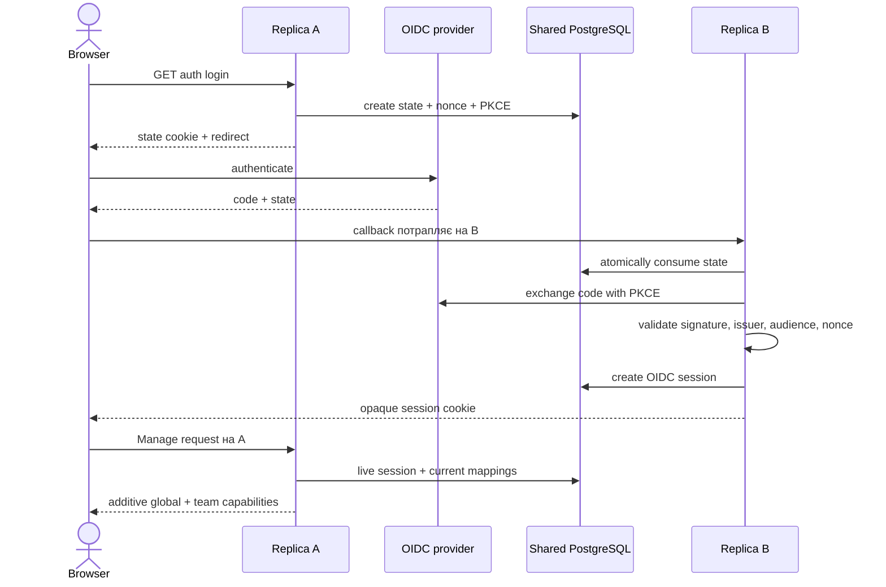
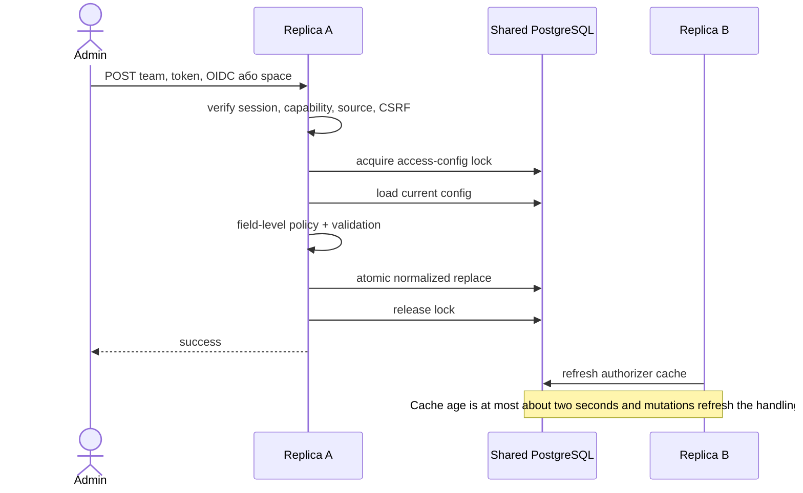
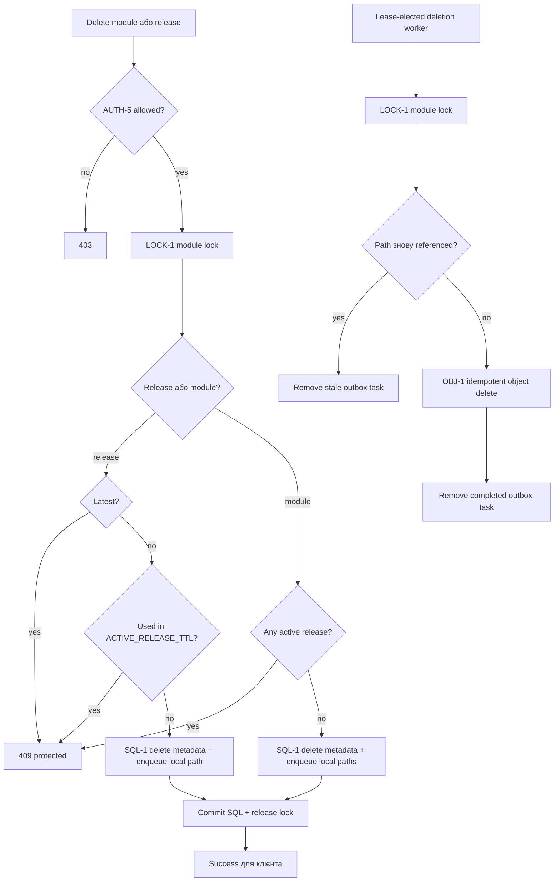
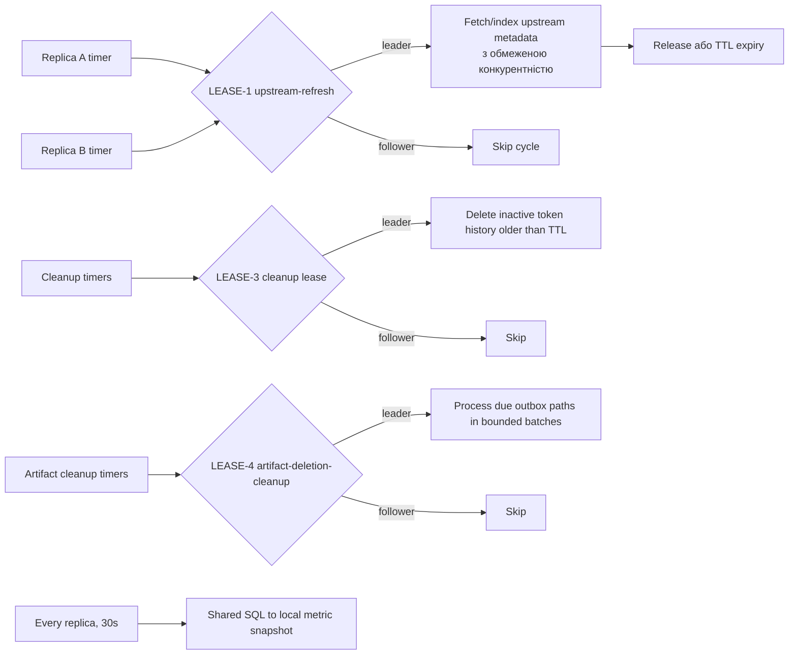

# Runtime-схеми та карта перевірок

[English version](SCHEMA.md)

> Це операційна карта `puppet-forge`. Вона доповнює
> [ARCHITECTURE.uk.md](ARCHITECTURE.uk.md), [METRICS.uk.md](METRICS.uk.md) і
> [BACKUP_RESTORE.uk.md](BACKUP_RESTORE.uk.md) runtime-діаграмами, межами стану,
> запобіжниками та процедурами точкової перевірки.

## Як користуватися документом

Кожен важливий runtime-вузол має стабільний ідентифікатор: `HTTP-1`, `SQL-1`,
`BG-1` тощо. За ним можна зіставити діаграму, інваріант, метрику, симптом
відмови й перевірку.

Використовуються три види стану:

- **спільний довговічний стан** — PostgreSQL та object storage, однакові для
  всіх реплік;
- **спільні секрети** — однакові на всіх репліках, але не зберігаються в БД;
- **локальний стан процесу** — bounded caches, singleflight, rate limits і
  metric snapshots, які навмисно відрізняються між репліками.

Коректність кількох реплік забезпечують SQL locks/leases/sessions і create-only
object writes. Sticky sessions для неї не потрібні.

## Робота одного екземпляра



### Гарантії одного екземпляра

- PostgreSQL рекомендований, але SQLite підтримується, бо всі writers живуть в
  одному процесі.
- SQLite module/access locks — process mutexes, а не cross-host coordination.
- Restart очищає локальні caches і rate counters, але зберігає metadata,
  access, sessions, leases та artifacts.
- API й metrics listeners окремі; `/metrics` відсутній на application listener.

## Робота кількох екземплярів



### Запобіжники multi-instance

| Вузол       | Межа                                       | Механізм                                                                                    | Наслідок помилки                                                                             |
| ----------- | ------------------------------------------ | ------------------------------------------------------------------------------------------- | -------------------------------------------------------------------------------------------- |
| `SQL-1`     | один PostgreSQL для всіх                   | transactions, constraints, advisory locks, leases                                           | розбіжність access, sessions і duplicate work                                                |
| `OBJ-1`     | один bucket/prefix                         | create-only writes, checksum verification                                                   | SQL release недоступний із частини реплік                                                    |
| `SEC-3`     | byte-identical secrets                     | один Secret або secret manager                                                              | випадковий logout, різні права між pods                                                      |
| `LOCK-1`    | один writer на module identity             | PostgreSQL advisory module lock                                                             | конфлікт publish/delete                                                                      |
| `LOCK-2`    | один writer access config                  | PostgreSQL advisory access lock                                                             | втрачені team/token/OIDC updates                                                             |
| `LEASE-1`   | одна репліка-лідер фонового оновлення      | SQL lease `upstream-refresh`; локальна для лідера межа воркерів `UPSTREAM_SYNC_CONCURRENCY` | дубльований або необмежений трафік оновлення                                                 |
| `LEASE-2`   | один loader cold artifact                  | SQL lease від object path, TTL 75s                                                          | duplicate upstream download або затримка                                                     |
| `LEASE-3`   | один history cleanup                       | SQL lease `access-token-history-cleanup`                                                    | дубльований, але ідемпотентний cleanup                                                       |
| `LEASE-4`   | один worker видалення артефактів           | SQL lease `artifact-deletion-cleanup`                                                       | duplicate idempotent deletes; module lock і повторна перевірка reference захищають republish |
| `LEASE-5`   | один worker retention видалених релізів    | SQL lease `deleted-release-cleanup`                                                         | дубльований cleanup позначок; SQL delete лишається ідемпотентним                             |
| `LEASE-6`   | один worker retention використання релізів | SQL lease `release-usage-cleanup`                                                           | застарілі usage rows зберігаються довше; active-запити все одно фільтрують їх за часом       |
| `LEASE-7`   | один worker retention browser sessions     | SQL lease `session-state-cleanup`                                                           | expired/consumed rows зберігаються довше; auth усе одно перевіряє expiry і revocation        |
| `LEASE-8`   | один worker retention shared rate limits   | SQL lease `rate-limit-cleanup`                                                              | expired limiter rows зберігаються довше; active counters лишаються коректними                |
| `SESSION-1` | shared browser sessions                    | opaque cookie ID + SQL row                                                                  | залежність від sticky session                                                                |
| `CACHE-1`   | JSON cache навмисно локальний              | bounded memory cache + TTL                                                                  | різний hit ratio/коротка різниця freshness                                                   |
| `RATE-1`    | login/mutation limits спільні              | atomic SQL counters + retention                                                             | при відмові limiter storage sensitive request відхиляється, а не обходить захист             |
| `RATE-2`    | read limits навмисно локальні              | bounded counters, expiry heap, nearest-reset eviction при заповненні                        | read allowance росте з replicas; hard quota має бути на edge                                 |

SQLite не є multi-instance backend. Helm має відхиляти SQLite при
`replicaCount > 1` або ввімкненому autoscaling.

## Конвеєр запиту



Request ID та observability охоплюють також запити, відхилені security layer.

## Інвентар HTTP-методів і дій

| Метод           | Шлях                                                         | Дія                                | Право або запобіжник                                                              |
| --------------- | ------------------------------------------------------------ | ---------------------------------- | --------------------------------------------------------------------------------- |
| `GET`           | `/healthz`                                                   | liveness процесу                   | без dependencies                                                                  |
| `GET`           | `/readyz`                                                    | SQL та object-storage readiness    | dependency deadline 2s                                                            |
| `GET`           | `/`                                                          | каталог і filter                   | завжди public information                                                         |
| `GET`           | `/modules/{owner}/{name}`                                    | сторінка модуля                    | завжди public information                                                         |
| `GET`           | `/modules/{owner}/{name}/versions/{version}/files/{path}`    | файл з архіву                      | read auth або public access                                                       |
| `GET`           | `/auth/login`                                                | почати OIDC                        | OIDC enabled, shared SQL rate limit                                               |
| `GET`           | `/auth/callback`                                             | перевірити OIDC і створити session | state, nonce, PKCE, shared SQL rate limit                                         |
| `GET`           | `/auth/logout`                                               | revoke OIDC session                | cleanup навіть stale session                                                      |
| `GET`           | `/manage/login`                                              | login form                         | `no-store`                                                                        |
| `POST`          | `/manage/login`                                              | token browser session              | admin/team credential, shared SQL rate limit                                      |
| `POST`          | `/manage/logout`                                             | revoke session                     | session-bound CSRF                                                                |
| `GET`           | `/manage`                                                    | overview                           | global/team management capability                                                 |
| `GET`           | `/manage/modules`                                            | manageable catalog                 | global/team management capability                                                 |
| `POST`          | `/manage/modules`                                            | publish archive                    | publish space, CSRF, upload limit                                                 |
| `POST`          | `/manage/modules/{owner}/{name}/delete`                      | delete module                      | delete capability, active protection                                              |
| `POST`          | `/manage/modules/{owner}/{name}/versions/{version}/delete`   | delete release                     | delete capability, latest/active protection                                       |
| `POST`          | `/manage/upstream`                                           | index upstream module              | global admin, CSRF                                                                |
| `GET`           | `/manage/teams`                                              | teams list                         | global sees all, team admin assigned                                              |
| `GET`, `POST`   | `/manage/teams/new`                                          | render/create team                 | global admin, CSRF on POST                                                        |
| `GET`           | `/manage/teams/{team}`                                       | redirect до Access                 | global або matching team admin                                                    |
| `GET`           | `/manage/teams/{team}/{access,tokens,modules}`               | team pages                         | global або matching team admin                                                    |
| `GET`, `POST`   | `/manage/admin/access`                                       | global/team OIDC mappings          | field policy, CSRF, config lock                                                   |
| `GET`, `POST`   | `/manage/admin/spaces`                                       | space assignments                  | global admin, CSRF, config lock                                                   |
| `GET`, `POST`   | `/manage/access`                                             | compatibility access route         | canonical-equivalent checks                                                       |
| `GET`, `POST`   | `/manage/access/add`                                         | compatibility Add Team             | global admin, CSRF on POST                                                        |
| `POST`          | `/manage/access/token`                                       | create/rotate/revoke token         | global/matching team admin, CSRF, lock                                            |
| `GET`           | `/api/v1/modules`                                            | list/search                        | read capability, local rate limit                                                 |
| `POST`          | `/api/v1/modules`                                            | publish `space` + `file`           | selected-space permission, metadata identity                                      |
| `GET`           | `/api/v1/manage/publish-spaces`                              | effective spaces                   | publish-capable principal                                                         |
| `GET`, `DELETE` | `/api/v1/modules/{owner}/{name}`                             | get/delete module                  | read або delete capability                                                        |
| `GET`, `DELETE` | `/api/v1/modules/{owner}/{name}/versions/{version}`          | get/delete release                 | read/delete; cold checksum hydration                                              |
| `GET`, `HEAD`   | `/api/v1/modules/{owner}/{name}/versions/{version}/download` | stream artifact                    | read, range/ETag, rate limit                                                      |
| `GET`           | `/v3/modules/{slug}`                                         | Forge module metadata              | read/public; fresh response робить index, fresh і cached response оновлюють usage |
| `GET`           | `/v3/releases/{slug}`                                        | Forge release metadata             | read/public; complete checksums                                                   |
| `GET`, `HEAD`   | `/v3/files/{filename}`                                       | artifact                           | read/public; shared cold cache + range                                            |
| `GET`, `HEAD`   | інші `/v3/*`                                                 | transparent proxy                  | read/public; bounded cache                                                        |
| `GET`           | metrics listener `/metrics`                                  | Prometheus exposition              | захист network layer за потреби                                                   |

`PUBLIC_MODULE_ACCESS=true` обходить лише read auth, але не publish, delete,
team/global administration або Manage session authorization.

## Внутрішні компоненти та дії

| Компонент   | Основні дії                                               | Durable effects                                |
| ----------- | --------------------------------------------------------- | ---------------------------------------------- |
| `APP-1`     | open stores, wiring, listeners/workers, shutdown          | schema bootstrap, leases                       |
| `AUTH-1`    | token auth, OIDC mapping, merge capabilities/spaces       | token `last_used`                              |
| `SESSION-1` | create/load/revoke token та OIDC sessions                 | session tables                                 |
| `OIDC-1`    | discovery, state/nonce/PKCE, exchange, validation, logout | OIDC state/session rows                        |
| `SVC-1`     | publish/list/get/download/delete/index/usage/refresh      | metadata, usage, tombstones, outbox, artifacts |
| `PROXY-1`   | JSON fetch/cache, relay, materialize artifact             | upstream cache, leases                         |
| `SQL-1`     | CRUD, locks, leases, sessions, usage, deletion outbox     | SQL tables                                     |
| `OBJ-1`     | stat/open/range/create-only upload/delete/list            | GCS/S3 objects                                 |
| `OBS-1`     | logs, HTTP/operation counters, inventory, build info      | process metrics                                |
| `RECON-1`   | SQL/object comparison; optional orphan deletion           | repair deletes only orphans                    |

## Послідовність publish



Інваріанти: приймаються лише `space` і `file`; `metadata.json` — source of truth;
owner дорівнює authorized space; module/version immutable; object path
content-addressed і create-only; повтор тих самих bytes ідемпотентний.

## Cold upstream release та r10k



Перший response уже повинен містити `file_md5`, обчислений із тих самих bytes,
які поверне `/v3/files/*`.

File body не буферизується в пам'яті replica. Власник lease перевіряє розмір і
`Content-Length` під час потокового запису з upstream до object storage, а
клієнт отримує bytes лише після повторного відкриття успішно завершеного shared
object.

Для cold module response observer та SQL indexing завершуються до запису
response, тому наступний release request не бачить частково створених рядків.
Observer зберігає request values, але використовує окремий 30-секундний context:
client cancellation не скасовує indexing, а незалежний timeout обмежує завислу
операцію.
JSON cache hit продовжує позначати current release як used, але не повторює
index module/releases. Fresh metadata узгоджується під час наступного cache miss
або periodic refresh.

## Browser auth між репліками



На всіх replicas мають збігатися `ACCESS_TOKEN_PEPPER`,
`MANAGE_SESSION_SECRET`, `OIDC_COOKIE_SECRET` і OIDC client configuration.
`ACCESS_TOKEN_PEPPER` та `MANAGE_SESSION_SECRET` мають бути незалежними
значеннями; startup відхиляє конфігурацію, яка повторно використовує той самий
ключ для обох ролей.

## Зміна access config і propagation



Ролі адитивні: global admin + team admin зберігає обидва набори capabilities.

## Delete та protected releases



Extra publish spaces не дають delete ownership.
Помилка object storage залишає outbox row для наступної спроби. SQL не зберігає
release row, який посилається на вже видалений цим workflow object.

## Background jobs і leader election



| Worker                    | Scope                 | Coordination                         | Recovery                                                                                  |
| ------------------------- | --------------------- | ------------------------------------ | ----------------------------------------------------------------------------------------- |
| upstream refresh          | singleton             | SQL lease `max(2*interval, 30s)`     | takeover після release/expiry, idempotent upsert                                          |
| cold artifact             | один leader на object | SQL lease 75s + local singleflight   | poll object, retry після expiry                                                           |
| token cleanup             | singleton             | SQL lease 1h                         | repeatable SQL delete                                                                     |
| artifact deletion cleanup | singleton             | SQL lease 2m + module lock на object | storage errors відкладаються на 1m; reference recheck скасовує stale task після republish |
| inventory metrics         | кожна replica         | немає                                | snapshot зі shared SQL                                                                    |

## Durable data model

```mermaid
erDiagram
    MODULES ||--o{ RELEASES : contains
    MODULES ||--o{ RELEASE_USAGE : records
    MODULES ||--o{ DELETED_RELEASES : suppresses
    ACCESS_TEAMS ||--o{ ACCESS_TOKENS : owns
    ACCESS_TEAMS ||--o{ ACCESS_PUBLISH_OWNERS : grants
    ACCESS_TEAMS ||--o{ ACCESS_OIDC_MAPPINGS : maps
    MANAGE_SESSIONS }o--|| ACCESS_TOKENS : binds
    MODULES {
        string id PK
        string owner
        string name
        string slug UK
        string latest_version
    }
    RELEASES {
        string id PK
        string module_id FK
        string version
        string source
        string storage_path
        string md5
        string sha256
        int size_bytes
    }
    RELEASE_USAGE {
        string module_id FK
        string version
        timestamp last_used_at
    }
    DELETED_RELEASES {
        string module_id FK
        string version
        timestamp deleted_at
    }
    ARTIFACT_DELETIONS {
        string storage_path PK
        string owner
        string name
        timestamp created_at
        timestamp next_attempt_at
    }
    ACCESS_TEAMS {
        string team PK
    }
    ACCESS_TOKENS {
        string token_id PK
        string team FK
        string role
        string token_hash UK
        timestamp expires_at
        timestamp revoked_at
    }
    ACCESS_PUBLISH_OWNERS {
        string team FK
        string owner
    }
    ACCESS_OIDC_MAPPINGS {
        string team FK
        string kind
        string value
    }
    MANAGE_SESSIONS {
        string session_hash PK
        string credential_id FK
        string csrf_secret
        timestamp expires_at
        timestamp revoked_at
    }
    OIDC_STATES {
        string state_hash PK
        string nonce
        string pkce_verifier
        timestamp expires_at
        timestamp consumed_at
    }
    OIDC_SESSIONS {
        string session_hash PK
        string subject
        string email
        string csrf_secret
        timestamp expires_at
        timestamp revoked_at
    }
    APP_LEASES {
        string name PK
        string holder
        timestamp expires_at
    }
    SCHEMA_METADATA {
        int version
    }
```



PostgreSQL schema bootstrap серіалізований global advisory lock. Binary не
працює зі schema version, новішою за підтримувану.

## Власність стану та consistency

| Стан                     | Де                     | Scope       | Гарантія                                                                                                                                                      |
| ------------------------ | ---------------------- | ----------- | ------------------------------------------------------------------------------------------------------------------------------------------------------------- |
| modules/releases/latest  | SQL                    | shared      | transaction + constraints                                                                                                                                     |
| release bytes            | object storage         | shared      | immutable create-only + SHA/size                                                                                                                              |
| usage/tombstones         | SQL                    | shared      | activity TTL; replicas об'єднують usage-записи через bounded throttle, lease-elected worker щодня чистить прострочені rows; exact-запит може відновити версію |
| teams/tokens/OIDC/spaces | SQL                    | shared      | serialized replace; cache до 2s                                                                                                                               |
| browser sessions         | SQL + opaque cookie    | shared      | TTL 8h, revocation, кожен request перевіряє SQL                                                                                                               |
| OIDC state               | SQL + encrypted cookie | shared      | TTL 5m, single-use                                                                                                                                            |
| worker leadership        | SQL                    | shared      | holder + expiry                                                                                                                                               |
| upstream JSON cache      | memory                 | per replica | bounded fresh/stale TTL                                                                                                                                       |
| rate counters            | memory                 | per replica | не cluster quota                                                                                                                                              |
| artifact singleflight    | memory                 | per replica | лише process deduplication                                                                                                                                    |
| inventory snapshot       | memory                 | per replica | shared SQL через інтервал `METRICS_REFRESH_INTERVAL` із випадковим зсувом                                                                                     |
| operation counters       | Prometheus registry    | per replica | aggregate sum/rate                                                                                                                                            |

Перед локальною відповіддю з metadata upstream-релізу сервіс перевіряє
збережені bytes за SHA-256 і розміром. Repair утримує той самий per-object SQL
lease, що й cold materialization. Окремий щоденний lease видаляє лише objects
без SQL-посилань із `upstream-cache/`, старші за
`UPSTREAM_ARTIFACT_ORPHAN_TTL`.

Явний reconciliation repair перед видаленням orphan-об'єкта під локальним
artifact prefix бере той самий per-module lock, що й publish, та повторно
перевіряє SQL-посилання.

## Observability у кількох replicas

Prometheus має scrape кожен metrics endpoint.

| Shape                                   | Cluster query                                         | Причина                               |
| --------------------------------------- | ----------------------------------------------------- | ------------------------------------- |
| HTTP/publish/delete/cache/sync counters | `sum by (...) (rate(metric_total[$__rate_interval]))` | кожна pod має власні increments       |
| shared-SQL inventory gauges             | `max by (...) (metric)`                               | `sum` множить inventory на replicas   |
| in-flight                               | `sum(metric)`                                         | requests різні на кожній pod          |
| singleton refresh gauges                | `max by (...) (metric)`                               | значення оновлює leader               |
| target health                           | дивитися per `instance`                               | aggregate не має приховувати dead pod |

Для інциденту корелюйте structured logs через `request_id`. Для leases/cache
використовуйте `LOG_LEVEL=debug`.

## Матриця точкових перевірок

| Вузол       | Інваріант                                              | Evidence                                                                           | Automated check             |
| ----------- | ------------------------------------------------------ | ---------------------------------------------------------------------------------- | --------------------------- |
| `HTTP-1`    | API/metrics listeners незалежні                        | startup addresses, обидва targets                                                  | `make http-smoke`           |
| `SEC-1`     | untrusted forwarded headers не змінюють origin         | warning + `400`/`421`                                                              | boundary unit/fuzz          |
| `AUTH-1`    | global/team roles адитивні                             | обидва UI/API capability sets                                                      | combined-role tests         |
| `AUTH-2`    | public обходить лише read                              | anonymous GET, publish/delete fail                                                 | public-access tests         |
| `AUTH-3`    | backend перевіряє space                                | tampered space `403`                                                               | publish auth tests          |
| `AUTH-4`    | mutation має session CSRF                              | mismatch `403`                                                                     | CSRF tests                  |
| `SESSION-1` | session portable між pods                              | alternate direct pod requests                                                      | shared-session tests        |
| `OIDC-1`    | single-use state, nonce, PKCE                          | replay fails, cross-pod succeeds                                                   | OIDC flow tests             |
| `SVC-1`     | metadata owner = space                                 | mismatch validation error                                                          | archive tests               |
| `LOCK-1`    | concurrent publish deterministic                       | один release/object                                                                | concurrent publish/parity   |
| `LOCK-2`    | access updates serialized                              | normalized config без lost update                                                  | parity lock test            |
| `OBJ-1`     | SQL checksum = served bytes                            | clean reconcile                                                                    | storage/reconcile tests     |
| `PROXY-1`   | cold response already has `file_md5`                   | first r10k succeeds                                                                | cold checksum test          |
| `LEASE-1`   | один refresh leader                                    | acquired vs skipped logs                                                           | lease tests                 |
| `LEASE-2`   | один upstream fetch на object                          | concurrent replicas complete                                                       | proxy coalescing test       |
| `LEASE-3`   | history cleanup singleton і repeatable                 | один purge на цикл; active tokens не видаляються                                   | cleanup store/service tests |
| `LEASE-4`   | artifact cleanup singleton, retryable і republish-safe | pending gauge зменшується; error counter припиняє рости; referenced paths canceled | outbox parity/service tests |
| `READY-1`   | SQL або object storage down робить pod unready         | `/readyz` `503`                                                                    | readiness tests             |
| `RECON-1`   | repair deletes only orphans                            | JSON report                                                                        | reconcile tests             |
| `OBS-1`     | scrape всіх replicas                                   | target per pod                                                                     | deployed target check       |

## Manual multi-replica playbook

1. **Shared config:** усі pods мають PostgreSQL, один bucket/prefix і один Secret
   source. Порівнюйте checksums, не secret values.
2. **Per-pod health:** напряму перевірте `/healthz` і `/readyz` кожної pod.
   Readiness зараз перевіряє SQL, але не object storage/upstream.
3. **Session portability:** login через pod A, той самий cookie jar — `/manage`
   через pod B без affinity.
4. **Access propagation:** create/revoke disposable token на A; revoked token має
   перестати діяти на B одразу після SQL commit, а новий має з'явитися в межах
   приблизно двосекундного authorizer cache TTL.
5. **Immutable publish:** одночасно надішліть однаковий archive на A/B; має бути
   один release/object. Інші bytes тієї самої identity мають дати `409`.
6. **Cold upstream:** одночасно запросіть uncached release через A/B; один lease
   owner завантажує upstream, а `file_md5` відповідає artifact bytes.
7. **Leader failover:** видаліть refresh leader; інша pod має отримати lease після
   release/expiry.
8. **Prometheus:** перевірте target на кожну pod, counters через `sum/rate`,
   shared inventory через `max`.
9. **Reconciliation:** `puppet-forge --reconcile-artifacts` має повернути clean
   report; repair застосовується лише до підтверджених orphans.

Корисні команди:

```bash
kubectl -n <namespace> get pods -l app.kubernetes.io/name=puppet-forge -o wide
kubectl -n <namespace> describe pods -l app.kubernetes.io/name=puppet-forge
kubectl -n <namespace> logs -l app.kubernetes.io/name=puppet-forge --prefix
puppet-forge --reconcile-artifacts
```

```promql
up{job=~".*puppet-forge.*"}
sum by (route, status) (rate(puppet_forge_http_requests_total[5m]))
max by (source) (puppet_forge_module_releases)
```

## Сценарії відмов

| Відмова                | Очікувана поведінка                                          | Перевірка                     |
| ---------------------- | ------------------------------------------------------------ | ----------------------------- |
| одна pod exit          | traffic через ready pods                                     | endpoints + per-instance `up` |
| PostgreSQL down        | `/readyz` fail, state mutations fail                         | readiness + SQL logs          |
| object storage down    | `/readyz` fail; artifact operations fail                     | readiness + storage logs      |
| upstream down          | local/cache works; new cold object fails; bounded stale JSON | cache/sync metrics            |
| refresh leader exit    | lease takeover                                               | debug lease logs              |
| artifact leader exit   | partial object не commit; retry після expiry                 | lease logs + checksum         |
| різний session secret  | failure лише на частині pods                                 | compare Secret/checksum       |
| stale authorizer cache | нормальна розбіжність до 2s                                  | retry + refresh logs          |
| scrape лише однієї pod | undercount cluster traffic                                   | Prometheus targets            |
| HPA scale              | correctness shared; local rate/cache змінюються              | HPA + targets + hit ratio     |

## Production checklist для Kubernetes

- PostgreSQL; ніколи SQLite з кількома replicas/HPA.
- Один shared GCS/S3 bucket і artifact prefix. Вибраний S3-compatible backend
  має атомарно виконувати `If-None-Match: *` для create-only `PutObject`.
- Один Secret для hash/session/OIDC values; rollout усіх pods після зміни.
- Startup/liveness/readiness probes увімкнені.
- Scrape кожної pod через metrics service/ServiceMonitor.
- Counters агрегуються `sum`, shared inventory — `max`.
- Щонайменше дві replicas, PDB і topology spread.
- Edge rate limit для strict cluster quota.
- NetworkPolicy для API, metrics, SQL, object storage, OIDC та upstream egress.
- Alerts на readiness, missing targets, 5xx, publish/delete errors і refresh age.
  One-shot reconciliation запускається окремо; зовнішній scheduler має створити
  alert за ненульовим exit status або непорожнім drift report, оскільки сервіс не
  експортує стан reconciliation як Prometheus-метрику.
- Перед production перевірені failover, cross-pod sessions, concurrent publish і
  cold upstream materialization.

## Пов'язана документація

- [README.uk.md](README.uk.md) — український user/operator guide.
- [ARCHITECTURE.uk.md](ARCHITECTURE.uk.md) — package responsibilities і design.
- [METRICS.uk.md](METRICS.uk.md) — визначення метрик.
- [BACKUP_RESTORE.uk.md](BACKUP_RESTORE.uk.md) — recovery та reconciliation.
- [Helm chart](deploy/puppet-forge) — Kubernetes configuration.
- [Grafana dashboard](examples/grafana/puppet-forge-dashboard.json).
- [Prometheus alerts](examples/prometheus/alerts/puppet-forge.yml).
